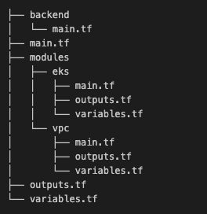
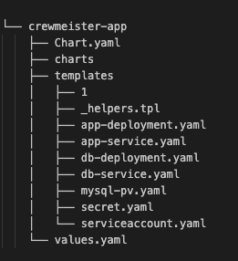

# DevOps Coding Challenge

This repository contains the source code, CI/CD , IAC (Terraform), HelmCharts (to deploy the app in EKS Cluster)

## Table of Contents

- [Running Locally with Docker Compose](#running-locally-with-docker-compose)
- [Terraform Configuration](#terraform-configuration)
- [Helm Chart](#helm-chart)
- [CI/CD Pipeline](#cicd-pipeline)

---

## Running Locally with Docker Compose

To run the application locally using **Docker Compose**, follow these steps:

### Prerequisites
Ensure you have **Docker** and **Docker Compose** installed on your machine. 

### Running the Application

docker-compose up --build

docker-compose down

### Key-Points
multi stage used for docker file

---

## Terraform Configuration

The Terraform configuration is located in the `terraform` folder and is used to provision the eks cluster for the project. The configuration includes modules for setting up a **VPC, and EKS cluster**.

### Key-Points
The Terraform configuration follows a modular strategy to promote reusability and maintainability.
Backed strategy to manage the state of the infrastructure.
S3 bucket and DynamoDB is used to store the state of the infrastructure.
Achived statefile Locking using DynamoDB.

### Directory Structure

---

## Helm Chart

The `helm` folder contains the **Helm chart** used to deploy the application **crewmeister-app**to a **Kubernetes cluster** created by using terraform. 

### Key-Points
The helm chart is organised in to basic structuere of helm chart.

### Directory Structure

### Deployed successfully in the EKS cluster
Attached few screenshot of the output where the application is deployed successfully in the EKS cluster.

### Directory Structure

### Deployed successfully in the EKS cluster
Attached few screenshot of the output where the application is deployed successfully in the EKS cluster.

---

## CI/CD Pipeline

The CI/CD pipeline is defined using GitHub Actions and is located in the `.github/workflows/crewmeister-ci.yml` file. The pipeline includes the following jobs:

1. **Build**: Builds the application using Maven.
2. **Code Quality**: Runs code quality checks using Maven.
3. **Docker**: Builds and pushes a Docker image to Docker Hub. https://hub.docker.com/repository/docker/sugesh23/devops-coding-challenge/ 
4. **UpdateK8s**: Updates the Kubernetes deployment manifest with the new Docker image tag and pushes the changes to the repository by using bitovi/github-actions-deploy-eks-helm@v1.2.12 from marketplace

### Secrets
The following secrets need to be set up in your GitHub repository for the workflow to function correctly:

- `DOCKER_USERNAME`: Your Docker Hub username.
- `DOCKER_PASSWORD`: Your Docker Hub password.
- `GITHUB_TOKEN`: Your GitHub token 
- `AWS_ACCESS_KEY_ID`: Your AWS access key ID
- `AWS_SECRET_ACCESS_KEY`: Your AWS secret access key
- `AWS_ROLE_ARN`: Your AWS roles ARN

### Reference Image

---
Note: The project can be improved in terms of security, monitoring, efficiency, scalability, and reliability. However, due to time constraints, it is currently limited to this version.

